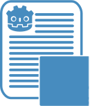

#  GoLogger
 A basic logging system for game events in into a .log file for Godot 4.

## Introduction
 Have you found yourself working on either several new features/systems or a big one involving several scripts where you've added a ton of print statements in order to debug. Littering the Output, making the info hard to decipher and even harder to manage? Maybe you want to your game to record events to help you debug issues your players are facing where you can't access their instance. Then you might want to look into creating a way for your game to log events in your game in order to provide a sort or snapshot of the history of events led to a bug or crash.

 This is a basic logging system meant to serve as a base for you to build upon and as such, is very barebones by design. That also means it's very flexible and scalable. With some minor changes, you can make it categorize events into separate files. The system can log whatever game event and/or data in a .log file but it won't magically generate log entries for you, meaning you will need to add 'GameLog.log()' calls to your code for it to actually log anything. <u>This system is only as comprehensive and complicated as you make it</u>.

## .log files
 The system in it's current state uses two possible log files. A "DEVFILE" created/located in the project file under "res://GameLog/game.log" which is meant to be used during development because it's easily accessible. While the "FILE" is the one intended for use for release, located in "user://logs/game.log" amongst the other log files Godot generates. The idea being that when a player encounters a bug or crash and they want to report it to the developer(you), you can ask them to include the log file to hopefully give you some insights as to what led to the issue.
	
